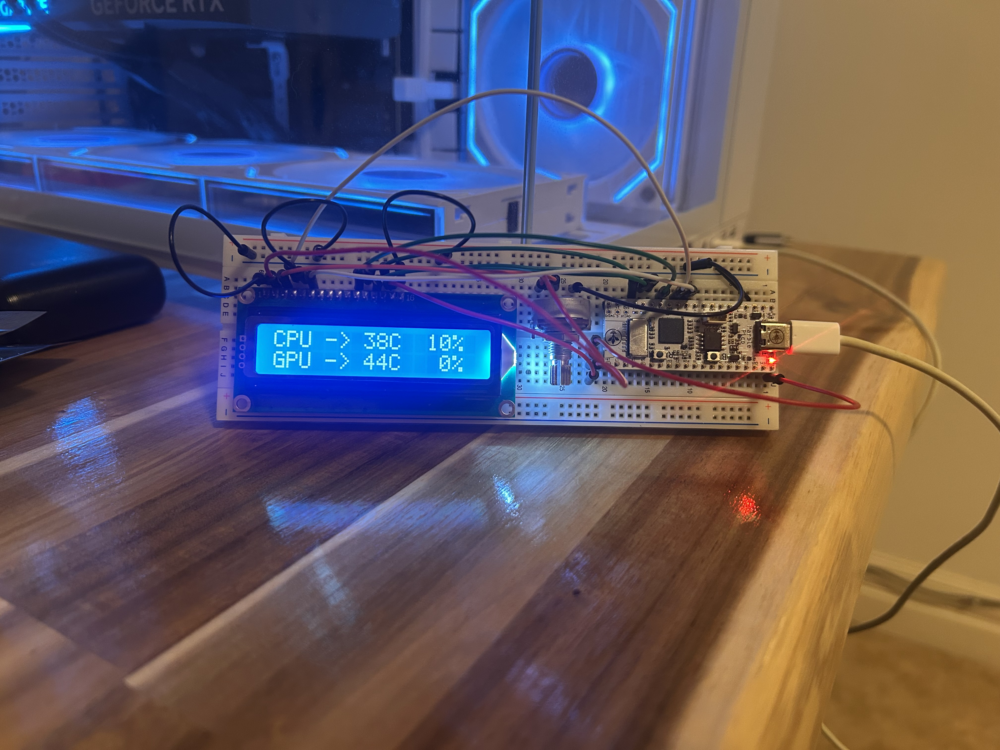
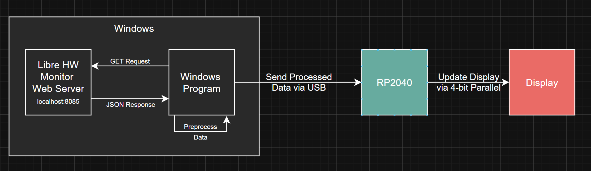
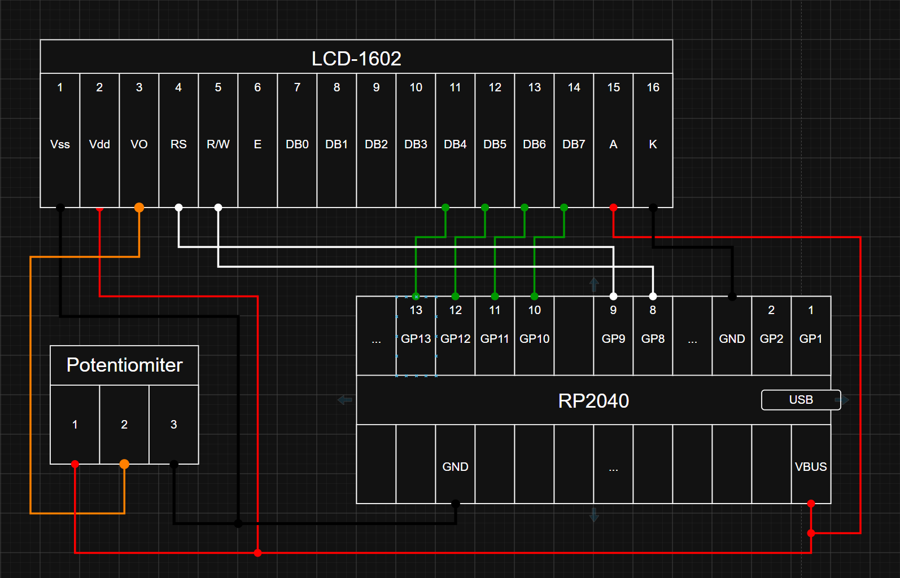

# pcVitals

pcVitals is a small embedded/desktop project that displays live PC hardware stats on a 16x2 character LCD mounted inside a PC case.

The Windows app reads sensor data from LibreHardwareMonitor, formats the values as a simple text packet, and sends it to an RP2040 board over USB serial. The Pico receives the packet, parses it, and updates the LCD using a custom 4-bit parallel HD44780-style driver.

<!--  -->

<video width="640" height="360" controls>
  <source src="images/PcVitals.mp4" type="video/mp4">
</video>



## Project Layout

```text
src_windows/   Windows C++ app that reads LibreHardwareMonitor and sends stats over USB serial
src_pico/      RP2040 firmware for receiving stats and driving the LCD
images/        Wiring and architecture diagrams
DataSheets/    LCD and board reference documents
```

## Hardware

- Marble Pico / RP2040 board
- LCD-1602A 16x2 character LCD
- Potentiometer for LCD contrast
- USB cable between the PC and Pico

The LCD does not use an I2C backpack. It is wired directly to the Pico and driven in 4-bit parallel mode. There is the option to use 8-bit parallel, however that uses double the GPIO pins.

The potentiometer is wired as a voltage divider and feeds the LCD `VO` pin for contrast adjustment.

## Wiring



| Component Pin | Connection / Pico Pin | Wire Color |
| :--- | :--- | :--- |
| **Vss** | GND | Black |
| **Vdd** | VBUS / 5V | Red |
| **VO** | Potentiometer wiper | Orange |
| **RS** | GP9 | White |
| **E** | GP8 | White |
| **D7** | GP13 | Green |
| **D6** | GP12 | Green |
| **D5** | GP11 | Green |
| **D4** | GP10 | Green |
| **A** | VBUS / 5V | Red |
| **K** | GND | Black |
| **POT1** | GND | Black |
| **POT3** | VBUS / 5V | Black |

## Data Flow


1. LibreHardwareMonitor runs on Windows with its remote web server enabled.
2. The Windows app requests `http://localhost:8085/data.json`.
3. The JSON response is parsed into CPU, GPU, and RAM stats.
4. The stats are serialized into a comma-delimited text line.
5. The line is written to the Pico over USB CDC serial.
6. The Pico reads the line through `stdio_usb`, parses it, and updates the LCD.

## Packet Format

Current format:

```text
S,<cpuTemp>,<cpuLoad>,<cpuClk>,<gpuTemp>,<gpuLoad>,<gpuVram>,<ramUsage>\n
```

Example:

```text
S,45.2,10.0,4200.0,35.0,99.0,8000.0,16000.0
```

Notes:

- `S` marks the start of a packet.
- The packet is terminated by a newline.
- `ramUsage` and `gpuVram` are sent in MB. The Pico display code formats RAM as GB on the LCD.

## Pico Firmware

The Pico firmware is in `src_pico/`.

Main responsibilities:

- Enable USB stdio with `pico_enable_stdio_usb(src_pico 1)`.
- Disable UART stdio with `pico_enable_stdio_uart(src_pico 0)`.
- Read incoming USB serial data in `serial_rx.c`.
- Parse complete newline-terminated packets into a `PcStats` struct.
- Render rotating LCD pages in `display.c`.
- Drive the LCD directly through the custom driver in `lcd.c`.

The display currently rotates through:

- CPU temperature/load and GPU temperature/load
- CPU clock and GPU VRAM
- RAM usage and project label

## LCD Driver

The LCD driver is a small custom HD44780-style 4-bit driver.

Public API:

```c
lcd_init();
lcd_clear();
lcd_set_cursor(row, col);
lcd_print(text);
```

Each character write follows this path:

```text
lcd_print
lcd_data
lcd_send_byte
lcd_write_nibble
gpio_put
lcd_pulse_enable
```

## Windows App

The Windows app is in `src_windows/`.

Main responsibilities:

- Connect to LibreHardwareMonitor through WinHTTP.
- Fetch `/data.json` from `localhost:8085`.
- Parse selected sensor values with `nlohmann/json`.
- Open the Pico's USB serial COM port.
- Wait until the Pico's serial connection is available.
- Send a stats packet once per second through `SerialPort::WriteStats`.
- Re-enter the serial wait loop if a write fails.

The COM port is currently hard-coded in `src_windows/main.cpp`:

```cpp
constexpr const char* COM_PORT = "COM6";
```

Update this value if Windows assigns your Pico a different COM port.

At startup, the app does not continue without serial. If the Pico is not available, it retries the configured COM port every 5 seconds:

```cpp
constexpr int SERIAL_RECONNECT_RETRY_SECONDS = 5;
```

The parser currently looks for these sensor names:

- `AMD Ryzen 5 7600X`
- `NVIDIA GeForce RTX 4070 SUPER`
- `Total Memory`

If the project is run on different hardware, the sensor paths in `src_windows/Parser.cpp` may need to be updated.

## Build and Run

### 1. Start LibreHardwareMonitor

1. Download LibreHardwareMonitor from the releases page:
   <https://github.com/LibreHardwareMonitor/LibreHardwareMonitor/releases>
2. Run `LibreHardwareMonitor.exe` as administrator.
3. Enable the remote web server from the Options menu.
4. Confirm that `http://localhost:8085/data.json` is available.

### 2. Build the Pico firmware

Use the Raspberry Pi Pico VS Code extension or CMake with the Pico SDK installed.

From `src_pico/`, configure and build the firmware, then flash the generated `.uf2` file to the Pico.

The firmware is configured for USB serial:

```cmake
pico_enable_stdio_uart(src_pico 0)
pico_enable_stdio_usb(src_pico 1)
```

### 3. Build the Windows app

Open an x64 Native Tools Command Prompt or a terminal with the Visual Studio build tools available.

```powershell
cd C:\Yaaqoob\Projects_WD\pcVitals\src_windows
cmake -S . -B build
cmake --build build --config Release
.\build\Release\pcVitals.exe
```

For a debug build:

```powershell
cd C:\Yaaqoob\Projects_WD\pcVitals\src_windows
cmake -S . -B build
cmake --build build --config Debug
.\build\Debug\pcVitals.exe
```

## Troubleshooting

- If the Windows app cannot connect to LibreHardwareMonitor, make sure the remote web server is enabled and running on port `8085`.
- If the app keeps retrying the serial connection, check Device Manager for the Pico's COM port and update `COM_PORT` in `src_windows/main.cpp`.
- If the LCD powers on but shows blocks or blank text, adjust the contrast potentiometer.
- If the LCD does not update, confirm that the Pico firmware was built with USB stdio enabled and that the Windows app is sending packets to the correct COM port.
