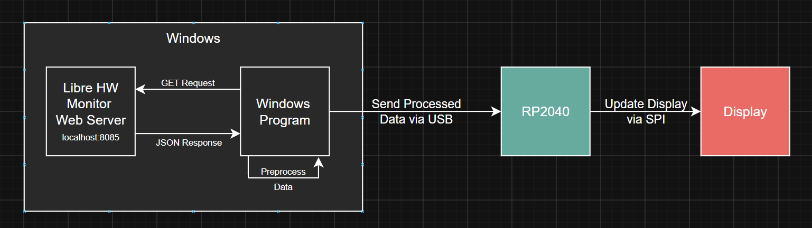
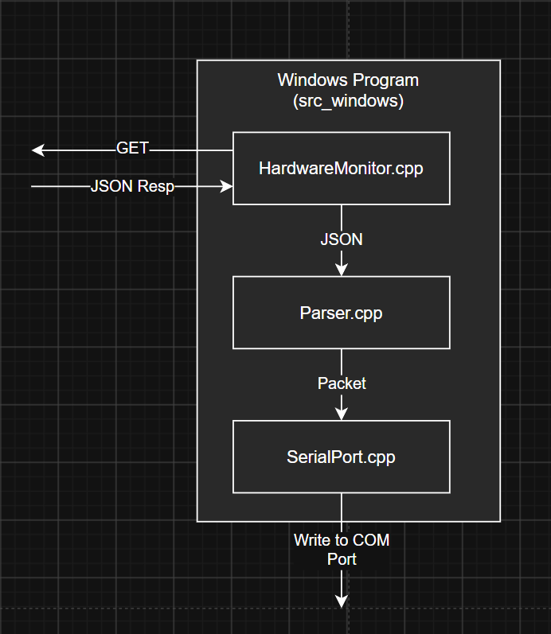

# pcVitals
Embedded project for displaying pc vital metrics in my pc case. 



# Data Pipeline:

1. Fetches raw hardware metrics from LibreHWMonitor's local web server.
2. Parses the JSON response into an internal C++ struct.
3. Serializes the metrics into a comma-delimited ASCII string.

# Packet
*Format:* `S,<cpuTemp>,<cpuLoad>,<cpuClk>,<gpuTemp>,<gpuLoad>,<gpuVram>,<ramUsage>,E\n`

*Example:* `S,45.2,10.0,4200.0,35.0,99.0,8000.0,16000.0,E\n`

**UART Parameters**
* **Baud Rate:** 115200
* **Data Bits:** 8
* **Parity:** None
* **Stop Bits:** 1

# Steps To Run:
1. Downloaded `LibreHardwareMonitor.zip` from https://github.com/LibreHardwareMonitor/LibreHardwareMonitor/releases -> under assets
2. Run the `LibreHardwareMonitor.exe` file as an administrator
3. Start the `Remote Web Server` by looking in the options tab
4. Compile and run:
    - Open x64 native tools in admin mode
    - `cd C:\Yaaqoob\Projects_WD\pcVitals\build `
    - `del CMakeCache.txt`
    - `cmake ..`
    - `cmake --build . --config Release`
    - `.\Release\pcVitals.exe`
    
    Or:
    ``` 
    cd C:\Yaaqoob\Projects_WD\pcVitals

    rmdir /s /q build

    mkdir build
    cd build

    cmake ..

    cmake --build . --config Debug

    .\Debug\pcVitals.exe
    ```
